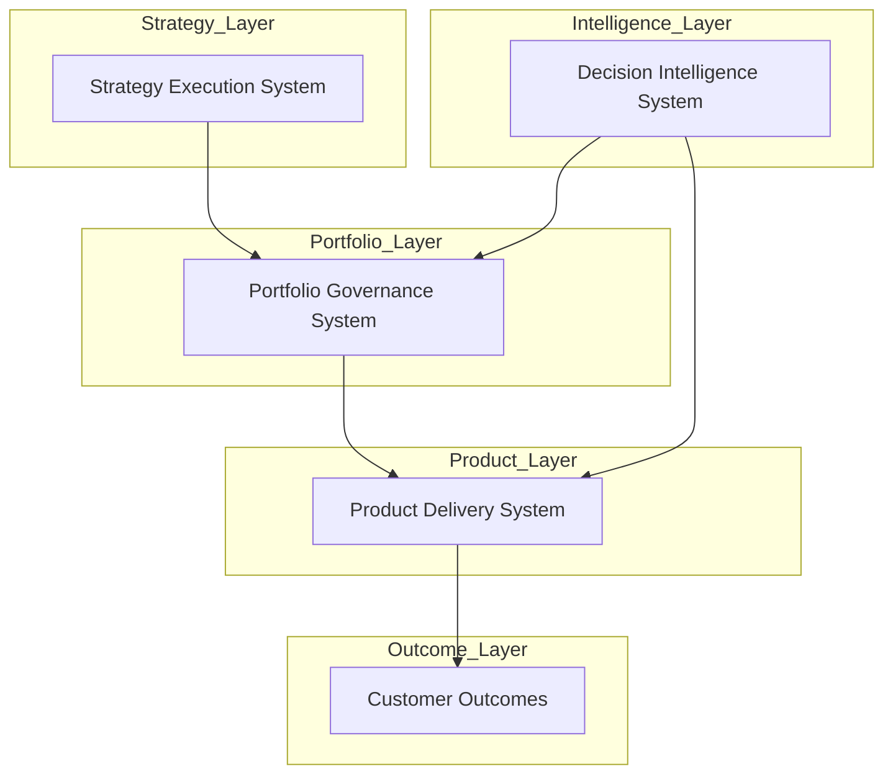

# Chuck Ferrando

Product leadership architect designing operating systems for strategy execution, portfolio governance, and product delivery.

---

# Product Leadership Systems Architecture

This GitHub portfolio documents several **operating systems used to run modern product organizations**.

Together these repositories form an integrated architecture connecting **enterprise strategy, portfolio governance, product execution, and AI-assisted decision support**.

---

## Product Leadership Systems Architecture

This architecture illustrates how enterprise strategy flows through portfolio governance and product execution systems to produce customer outcomes, supported by AI-assisted decision intelligence.

---

# Architecture Components

## Strategy → Execution

Defines how enterprise strategy is decomposed into initiatives and portfolio investments.

Repository:

https://github.com/ChuckFerrando/strategy-to-execution-framework

---

## Portfolio Governance

Defines the governance operating system used to manage product and technology portfolios.

Repository:

https://github.com/ChuckFerrando/enterprise-product-operating-model

---

## Product Operating System

Defines how product teams execute funded initiatives and deliver product outcomes.

Repository:

https://github.com/ChuckFerrando/product-operating-system

---

## AI-Assisted Product Operations

Explores how AI can support portfolio governance, delivery risk analysis, and decision preparation.

Repository:

https://github.com/ChuckFerrando/ai-assisted-product-operations

---

# Focus Areas

- Product Operations Leadership  
- Portfolio Governance and Capital Allocation  
- Strategy Execution and Organizational Systems  
- Product Operating Model Design  
- AI-Augmented Decision Support

---

# License

MIT License
