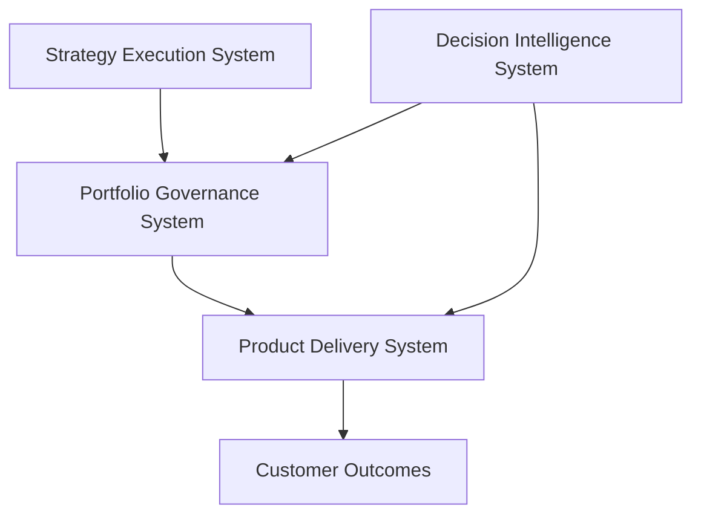

# Chuck Ferrando

Product leadership architect designing the operating systems used to run modern product organizations — from strategy execution through portfolio governance and product delivery, augmented by decision intelligence.

---

## Product Leadership Systems Architecture (PLSA)

This GitHub portfolio documents a set of integrated operating systems used to run a modern product organization.

It is designed to read like internal operating documentation from a large technology organization — and be understandable to a recruiter or hiring manager within **10 seconds**.

**Documentation portal (architecture index):**  
https://chuckferrando.github.io/product-leadership-systems

### Architecture Portal

The full architecture documentation portal can be accessed here:

https://github.com/ChuckFerrando/product-leadership-systems

---

## System Architecture Model

---

## How to Read This

The Product Leadership Systems Architecture (PLSA) illustrates how modern product organizations connect strategy to execution through structured operating systems.

The architecture flows from top to bottom:

**Strategy Execution System**  
Translates enterprise strategy into initiatives and funded investments.

**Portfolio Governance System**  
Prioritizes initiatives, allocates capital, manages risk, and maintains portfolio visibility across the organization.

**Product Delivery System**  
Defines how product teams execute funded initiatives through a structured product operating model.

**Customer Outcomes**  
The measurable results delivered to customers and the business.

**Decision Intelligence System**  
Provides AI-assisted analysis that supports governance and delivery decisions through scenario modeling, delivery risk detection, and executive insight.

Together, these systems form the **Product Leadership Systems Architecture (PLSA)** — an integrated operating model for running modern product organizations.

---

## System Repositories (Operating Systems)

The architecture is implemented through four system repositories.

| System | Purpose | Repository |
|------|------|------|
| **Strategy Execution System** | Framework translating enterprise strategy into initiatives and investment priorities. | https://github.com/ChuckFerrando/strategy-execution-system |
| **Portfolio Governance System (FLAGSHIP)** | Operating system used to prioritize investments, allocate capital, evaluate delivery risk, and maintain portfolio visibility. | https://github.com/ChuckFerrando/portfolio-governance-system |
| **Product Delivery System** | Operating model governing how product teams execute funded initiatives and deliver outcomes. | https://github.com/ChuckFerrando/product-delivery-system |
| **Decision Intelligence System** | AI-assisted analysis supporting scenario modeling, delivery risk detection, and executive decision preparation. | https://github.com/ChuckFerrando/decision-intelligence-system |

The **Portfolio Governance System** is the flagship repository and contains the most detailed executive governance artifacts.

---

## How to Use This Portfolio in Executive Conversations

This portfolio is designed to demonstrate how a product leader architects the systems used to run complex product organizations.

A recommended walkthrough:

1. **Start with the architecture model** to understand how strategy connects to execution.
2. **Explore the Portfolio Governance System** to see how investment decisions and portfolio prioritization are structured.
3. **Review the Strategy Execution System** to understand how strategic initiatives are defined and aligned to outcomes.
4. **Examine the Product Delivery System** to see how funded initiatives move through the product operating model.
5. **Look at the Decision Intelligence System** to understand how AI-assisted analysis supports executive decision making.

Together these systems illustrate how a product organization can improve:

- delivery predictability  
- portfolio visibility  
- capital allocation discipline  
- executive decision quality

---

## Focus Areas

This portfolio highlights leadership capabilities in:

- Product Operations Leadership
- Portfolio Governance and Capital Allocation
- Strategy-to-Execution Operating Systems
- Product Operating Model Architecture
- AI-Augmented Executive Decision Support

---

## License

This project is licensed under the MIT License.

See the LICENSE file in each repository for details.
