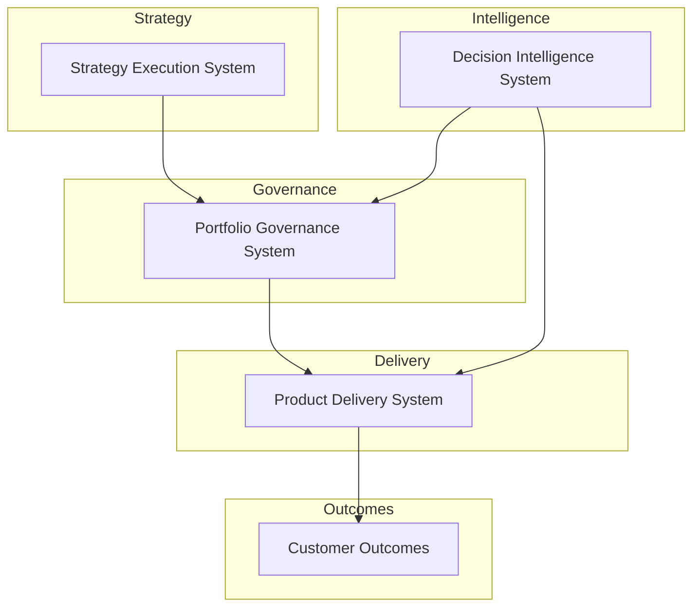

# Chuck Ferrando

Product leadership architect designing operating systems that connect enterprise strategy to governed product delivery and measurable outcomes.

This portfolio demonstrates how modern product organizations translate strategic priorities into funded initiatives, executed delivery, and data-driven decision making through structured operating systems.

---

## Product Leadership Systems Architecture

The repositories in this portfolio represent the operating systems used to run a modern product organization.

They illustrate how strategy, portfolio governance, product delivery, and AI-assisted decision intelligence connect to enable predictable execution at scale.

---

## System Repositories

### Portfolio Governance System

Operating system for evaluating investment proposals, allocating capital, assessing delivery risk, and maintaining portfolio visibility across the product portfolio.

[Portfolio Governance System](https://github.com/ChuckFerrando/portfolio-governance-system)

### Product Delivery System

Framework governing how funded initiatives are executed through product, engineering, and platform teams, translating portfolio decisions into coordinated delivery.

[Product Delivery System](https://github.com/ChuckFerrando/product-delivery-system)

### Decision Intelligence System

Analytical layer supporting governance and delivery through portfolio metrics, scenario modeling, risk visibility, and AI-assisted decision preparation.

[Decision Intelligence System](https://github.com/ChuckFerrando/decision-intelligence-system)

### Product Leadership Systems Documentation

Architecture index and documentation portal for the Product Leadership Systems Architecture, providing a structured entry point into the portfolio.

[Product Leadership Systems Documentation](https://github.com/ChuckFerrando/product-leadership-systems)

---

## Architecture Overview

The Product Leadership Systems Architecture illustrates how modern product organizations operate as interconnected systems that connect enterprise strategy to governed execution and measurable outcomes.

This architecture shows how strategic priorities become governed investments, how those investments move into product delivery, and how decision intelligence strengthens portfolio visibility and execution oversight.

---

## Purpose of This Portfolio

This portfolio demonstrates how product leadership teams can design and operate the systems required to improve:

- strategic alignment across product portfolios
- transparency in investment decisions
- delivery predictability across complex initiatives
- cross-functional coordination between product and engineering
- executive decision quality through structured governance and decision support

The repositories represent architecture and operating model artifacts rather than software implementations. Together, they illustrate the systems thinking required to run modern product organizations in complex, regulated, and execution-intensive environments.

---

## Intended Audience

This portfolio is designed for:

- recruiters and executive search firms
- hiring managers evaluating senior product leadership candidates
- CTO and CPO leadership teams
- organizations seeking leaders who can strengthen strategy execution, portfolio governance, and delivery operating models

Relevant roles include:

- VP Product Operations
- VP Strategy & Execution
- Chief of Staff to CPO / CTO
- Head of Product Operations
- DefenseTech portfolio leadership roles

---

## License

This repository is intended as a professional architecture and operating model portfolio artifact.

Unless otherwise noted, the materials in this portfolio are shared for professional reference and discussion.

