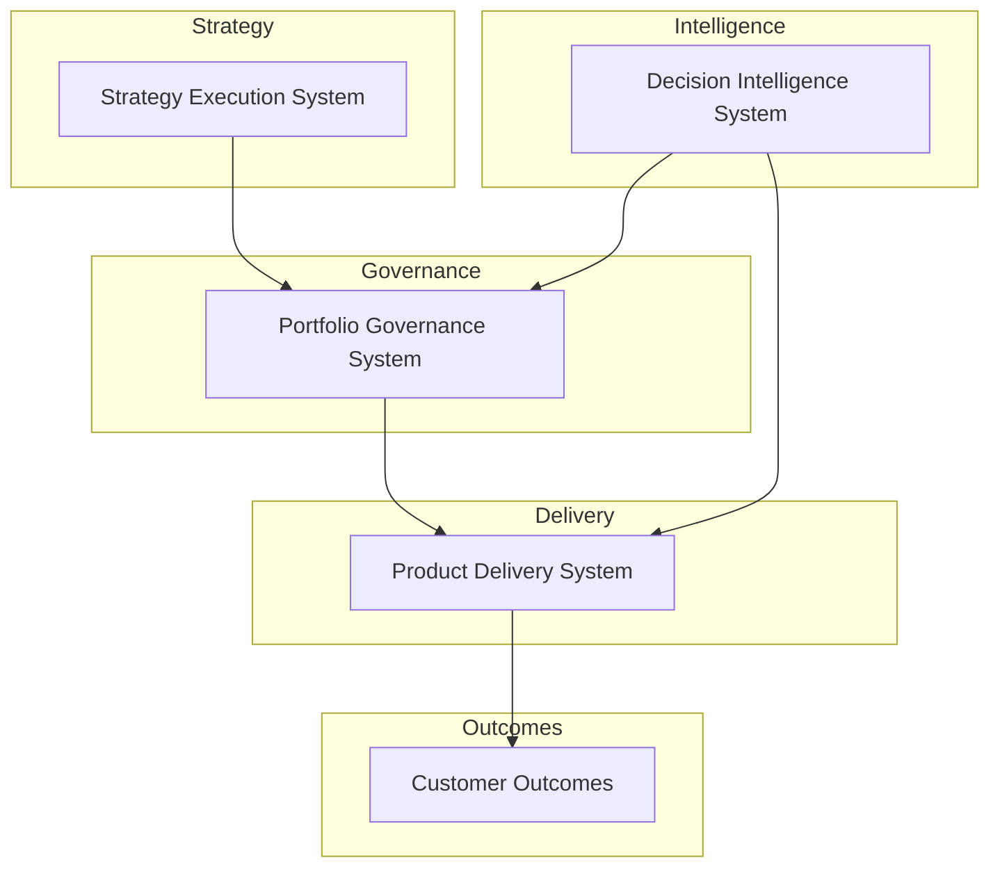
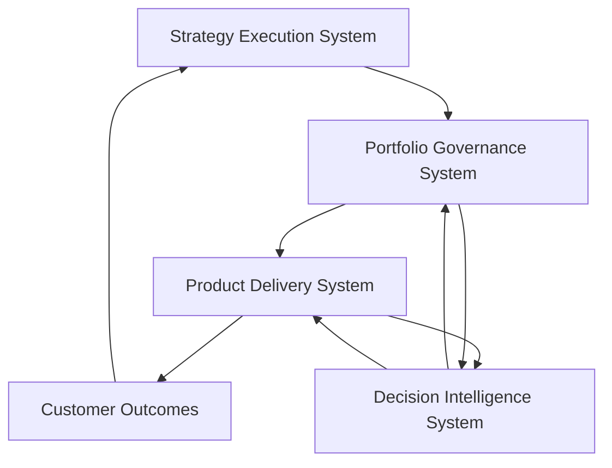

# Chuck Ferrando

Product leadership architect designing operating systems that connect enterprise strategy to governed product delivery and measurable outcomes.

This portfolio demonstrates how modern product organizations translate strategic priorities into funded initiatives, executed delivery, and data-driven decision making through structured operating systems.

---

## Product Leadership Systems Architecture

The repositories in this portfolio represent the operating systems used to run a modern product organization.

They illustrate how strategy, portfolio governance, product delivery, and AI-assisted decision intelligence connect to enable predictable execution at scale.

This architecture illustrates how modern product organizations translate enterprise strategy into governed delivery through structured operating systems.

---

## System Responsibilities

| System | Primary Responsibility |
|---|---|
| **Strategy Execution System** | Translate enterprise strategy into strategic initiatives, investment themes, and portfolio demand |
| **Portfolio Governance System** | Evaluate investments, allocate capital, assess execution risk, and maintain portfolio visibility |
| **Product Delivery System** | Govern execution of funded initiatives across product, engineering, and platform teams |
| **Decision Intelligence System** | Provide metrics, scenario analysis, portfolio visibility, and AI-assisted decision support |
| **Customer Outcomes** | Capture adoption, value realization, and business impact generated through delivery execution |

--- 

## Design Principles

The Product Leadership Systems Architecture is designed around a small set of operating principles that improve clarity, governance quality, and execution predictability.

- **Strategy alignment first**  
  Investments should be evaluated against explicit strategic priorities rather than local optimization or team-level preference.

- **Transparent investment decisions**  
  Portfolio decisions should be made through visible, structured criteria supported by documented rationale.

- **Governed execution**  
  Funded initiatives should move into delivery with clear accountability, risk visibility, and oversight mechanisms.

- **Portfolio visibility at all times**  
  Leadership should be able to assess investment distribution, delivery health, and execution risk across the portfolio.

- **Decision intelligence as a support layer**  
  Metrics, scenario modeling, and AI-assisted analysis should strengthen governance and delivery decisions without replacing leadership judgment.

- **Continuous feedback and adaptation**  
  Delivery performance and customer outcomes should inform future strategy, prioritization, and capital allocation decisions.

---

## Feedback Loops and Decision Support

The architecture is not purely linear. It operates as a continuous system in which delivery performance, portfolio insights, and customer outcomes feed back into future strategic and governance decisions.

This feedback model illustrates how modern product organizations continuously refine strategy, governance, and delivery through portfolio learning, execution visibility, and outcome measurement.

---

## System Repositories

### Strategy Execution System
Framework for translating enterprise strategy into strategic initiatives, investment themes, and portfolio demand.

[Strategy Execution System](https://github.com/ChuckFerrando/strategy-execution-system)

### Portfolio Governance System
Operating system for evaluating investment proposals, allocating capital, assessing delivery risk, and maintaining portfolio visibility.

[Portfolio Governance System](https://github.com/ChuckFerrando/portfolio-governance-system)

### Product Delivery System
Framework governing how funded initiatives are executed through product, engineering, and platform teams.

[Product Delivery System](https://github.com/ChuckFerrando/product-delivery-system)

### Decision Intelligence System
Analytical layer supporting governance and delivery through portfolio metrics, scenario modeling, risk visibility, and AI-assisted decision preparation.

[Decision Intelligence System](https://github.com/ChuckFerrando/decision-intelligence-system)

### Product Leadership Systems Documentation
Architecture portal and documentation index for the Product Leadership Systems Architecture.

[Product Leadership Systems Documentation](https://github.com/ChuckFerrando/product-leadership-systems)

---

## Primary Entry Point

The recommended starting point for this portfolio is the architecture portal, which provides a structured overview of the Product Leadership Systems Architecture.

- **Architecture Portal:** [Product Leadership Systems](https://chuckferrando.github.io/product-leadership-systems/)
- **Source Repository:** [product-leadership-systems](https://github.com/ChuckFerrando/product-leadership-systems)

---

## Architecture Overview

The Product Leadership Systems Architecture illustrates how modern product organizations operate as interconnected systems that connect enterprise strategy to governed execution and measurable outcomes.

This architecture shows how strategic priorities become governed investments, how those investments move into product delivery, and how decision intelligence strengthens portfolio visibility and execution oversight.

---

## Purpose of This Portfolio

This portfolio demonstrates how product leadership teams can design and operate the systems required to improve:

- strategic alignment across product portfolios
- transparency in investment decisions
- delivery predictability across complex initiatives
- cross-functional coordination between product and engineering
- executive decision quality through structured governance and decision support

The repositories represent architecture and operating model artifacts rather than software implementations. Together, they illustrate the systems thinking required to run modern product organizations in complex, regulated, and execution-intensive environments.

---

## Intended Audience

This portfolio is designed for:

- recruiters and executive search firms
- hiring managers evaluating senior product leadership candidates
- CTO and CPO leadership teams
- organizations seeking leaders who can strengthen strategy execution, portfolio governance, and delivery operating models

Relevant roles include:

- VP Product Operations
- VP Strategy & Execution
- Chief of Staff to CPO / CTO
- Head of Product Operations
- DefenseTech portfolio leadership roles

---

## License

This repository is intended as a professional architecture and operating model portfolio artifact.

Unless otherwise noted, the materials in this portfolio are shared for professional reference and discussion.

