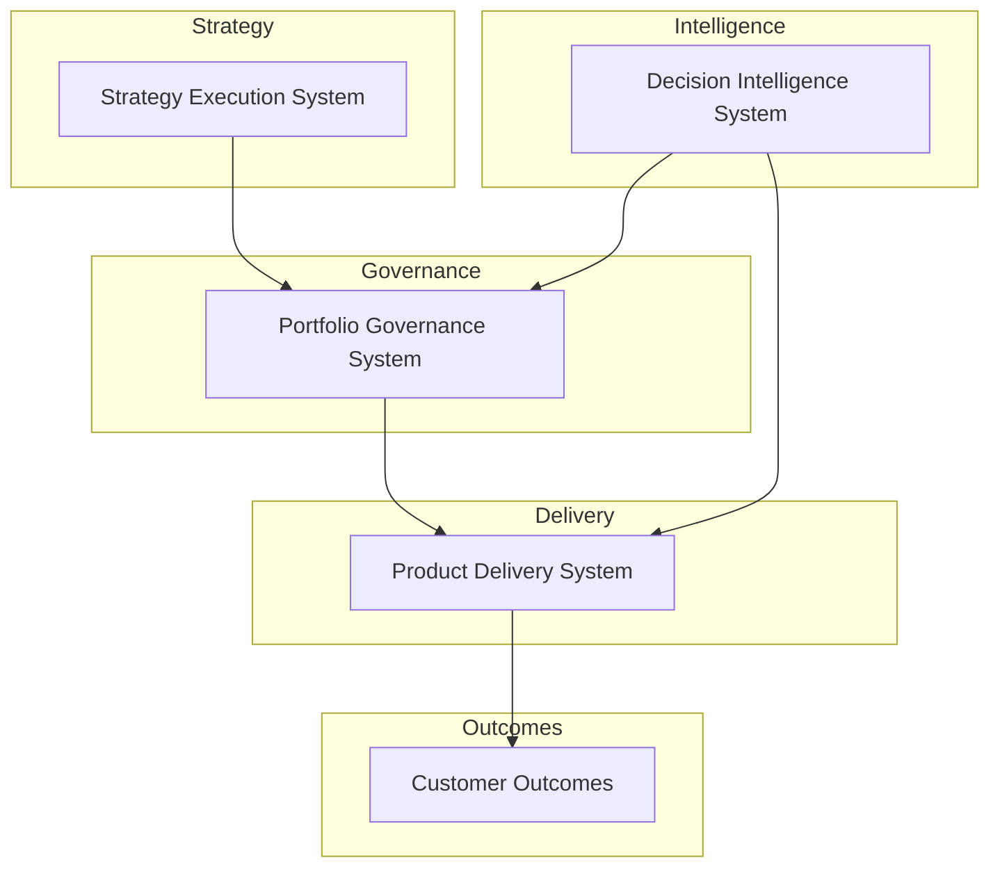

# Chuck Ferrando

Product leadership architect designing operating systems for strategy execution, portfolio governance, product delivery, and AI-assisted decision intelligence.

---

## Product Leadership Systems Architecture (10-second view)

This GitHub portfolio publishes executive-grade operating documentation—architecture artifacts, governance frameworks, and decision systems—used to run modern product organizations.

---

## Start Here

The recommended entry point to this portfolio is the **Product Leadership Systems Architecture portal**.

This repository explains how the operating systems connect and provides navigation across the full architecture.

**Architecture Portal (Index Repository)**  
https://github.com/ChuckFerrando/product-leadership-systems

From there you can explore the four operating systems that run a modern product organization:

| System | Purpose | Repository |
|------|------|------|
| Strategy Execution System | Translates enterprise strategy into initiatives and portfolio-ready investments | https://github.com/ChuckFerrando/strategy-execution-system |
| Portfolio Governance System | Governs prioritization, capital allocation, delivery risk evaluation, and portfolio visibility | https://github.com/ChuckFerrando/portfolio-governance-system |
| Product Delivery System | Operating model for executing funded initiatives with predictable delivery outcomes | https://github.com/ChuckFerrando/product-delivery-system |
| Decision Intelligence System | AI-assisted analysis supporting portfolio governance and delivery decisions | https://github.com/ChuckFerrando/decision-intelligence-system |

---

## Intended Audience

This portfolio is designed for executive audiences evaluating product and technology leadership capability.

Typical readers include:

• Recruiters and executive search firms  
• CTO and CPO leadership teams  
• Hiring managers for product, platform, and engineering organizations  
• Strategy and operations leaders within technology companies  

The architecture artifacts are intended to demonstrate readiness for roles such as:

• VP Product Operations  
• Chief of Staff to CPO / CTO  
• VP Strategy & Execution  
• Portfolio leadership roles in complex technology environments (Enterprise SaaS, FinTech, DefenseTech)

---

## License

MIT License

Copyright (c) 2026 Chuck Ferrando

Permission is hereby granted, free of charge, to any person obtaining a copy
of this documentation and associated files to use, copy, modify, merge,
publish, distribute, sublicense, and/or sell copies, subject to the
following conditions:

The above copyright notice and this permission notice shall be included
in all copies or substantial portions of the documentation.

THE DOCUMENTATION IS PROVIDED "AS IS", WITHOUT WARRANTY OF ANY KIND.
