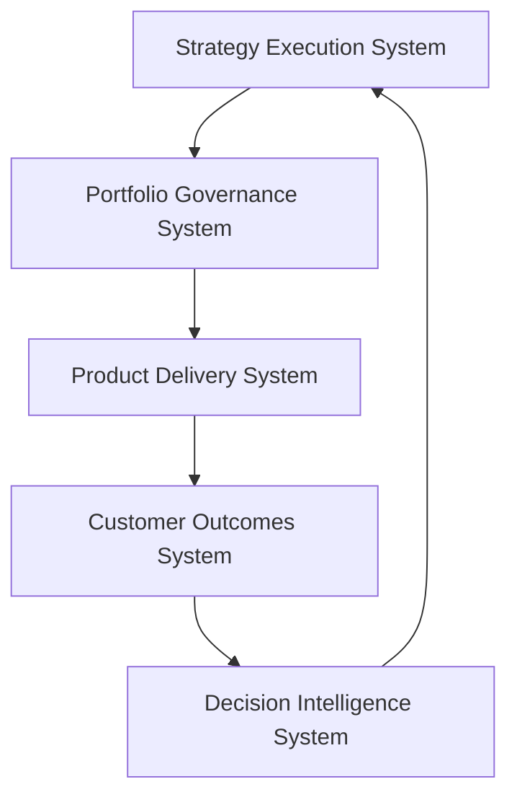
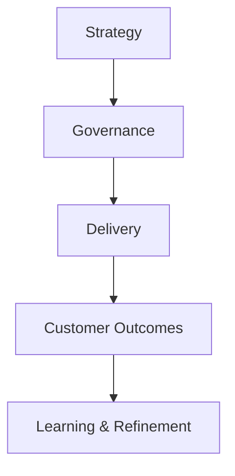
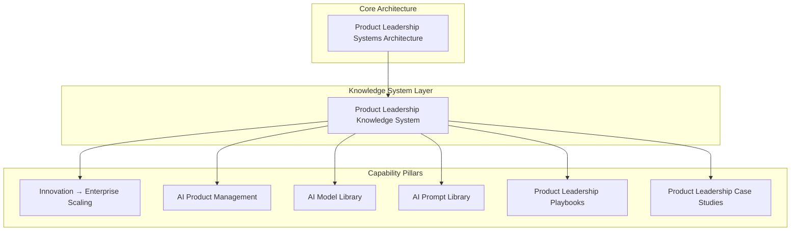
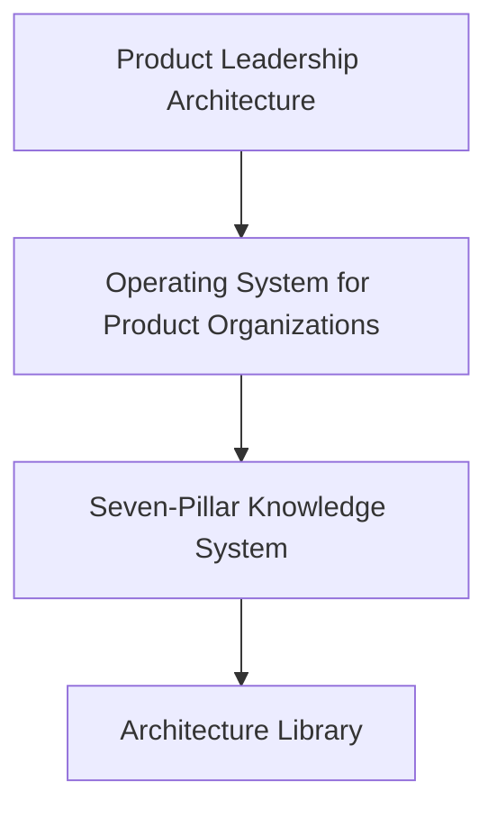

# Chuck Ferrando

Product leadership architect designing operating systems that connect strategy, portfolio governance, product delivery, and customer outcomes.

My work focuses on building **product leadership operating systems** that enable organizations to translate strategy into measurable impact.

---

# Product Leadership Systems Architecture


This architecture models product organizations as coordinated leadership systems rather than isolated teams.

---

# Product Leadership Knowledge System

The architecture is implemented as a **seven-pillar GitHub knowledge system**.

| Pillar | Repository | Purpose |
|---|---|---|
| Pillar 1 | `product-leadership-systems-architecture` | Core architecture model |
| Pillar 2 | `innovation-lab-enterprise-scaling` | Innovation to enterprise scaling operating model |
| Pillar 3 | `ai-product-management` | AI product strategy and operating frameworks |
| Pillar 4 | `ai-model-library` | AI architecture patterns and model reference implementations |
| Pillar 5 | `ai-prompt-library` | Prompt systems for product leadership, governance, and execution |
| Pillar 6 | `product-leadership-playbooks` | Operating playbooks for running product organizations |
| Pillar 7 | `product-leadership-case-studies` | Applied examples showing the architecture in practice |

Together, these repositories form a structured public knowledge system for modern product leadership.

The system is designed to show how product organizations connect strategy, governance, delivery, and outcomes through a continuous learning cycle.



---

## Seven-Pillar Knowledge System Architecture

The Product Leadership Knowledge System is organized as a layered architecture built on top of the Product Leadership Systems Architecture.



---

# Flagship Architecture

The flagship repository in this portfolio is:

**[product-leadership-systems-architecture](https://github.com/ChuckFerrando/product-leadership-systems-architecture)**

This repository defines the core Product Leadership Systems Architecture (PLSA) and serves as the architectural foundation of the broader Product Leadership Knowledge System.

It includes:

• the operating model  
• system interaction logic  
• governance structures  
• ownership boundaries  
• delivery coordination mechanisms  
• outcome measurement frameworks  
• decision intelligence support models  

This is the primary repository readers should use to understand the overall architecture.

---

# Architecture Library

The flagship repository is organized as a structured architecture library rather than a collection of disconnected documents.

The core architecture spine is:

```text
SYSTEM_INDEX.md
↓
Product Leadership Operating System Overview
↓
Unified Product Leadership Systems Architecture
↓
System Responsibilities Matrix
```

These artifacts work together as follows:

- **SYSTEM_INDEX.md** provides the navigation map for the repository
- **Product Leadership Operating System Overview** serves as the front-door architecture document
- **Unified Product Leadership Systems Architecture** defines the canonical system model
- **System Responsibilities Matrix** clarifies ownership boundaries across the operating systems

This structure mirrors the way mature internal architecture documentation is organized in large technology organizations.

---

# Architecture Evolution

Earlier design explorations of individual operating systems are preserved in archived repositories.

These repositories represent initial architecture work completed before the Product Leadership Systems Architecture was consolidated into a unified system model.

Archived repositories include:

• `portfolio-governance-system`  
• `strategy-execution-system`  
• `decision-intelligence-system`  
• `product-delivery-system`  

These repositories reflect an earlier phase of the architecture in which major operating systems were documented separately.

The current architecture consolidates those concepts into the flagship repository:

**[product-leadership-systems-architecture](https://github.com/ChuckFerrando/product-leadership-systems-architecture)**

Readers should refer to the unified architecture repository for the current system model and canonical documentation.

---

# About

I design **product leadership operating systems** that connect strategy, portfolio governance, product delivery, customer outcomes, and decision intelligence.

My work focuses on building structured operating models that help organizations translate strategic intent into coordinated execution and measurable impact.

Core areas of focus include:

• product operating models  
• portfolio governance  
• strategy-to-execution systems  
• product delivery architecture  
• decision intelligence frameworks  
• AI-enabled product leadership  

This GitHub portfolio is designed as a public architecture library for modern product leadership.

LinkedIn:  
[linkedin.com/in/chuckferrando](https://linkedin.com/in/chuckferrando)

---

# What This Accomplishes

This GitHub portfolio is designed to present product leadership as a **system architecture**, rather than a collection of disconnected frameworks or documents.

By organizing the repositories into a structured knowledge system, the portfolio demonstrates how modern product organizations can operate through coordinated leadership systems.

The architecture communicates several key ideas clearly:

• product leadership can be modeled as an operating system  
• strategy, governance, delivery, and outcomes must operate as coordinated systems  
• decision intelligence enables continuous learning and improvement  
• architecture documentation can function as a navigable leadership reference  

For readers exploring the portfolio, the structure makes it possible to quickly understand:

1. the architecture model  
2. the operating systems that compose it  
3. how those systems interact  
4. where to explore deeper artifacts and frameworks  

This structure transforms the repository from a set of documents into a **coherent architecture library for product leadership operating models**.

---

# Example Mental Model for the Viewer

When a reader lands on this profile, the architecture is intended to communicate a clear narrative:



---

## License

This repository is intended as a professional architecture and operating model portfolio artifact.

Unless otherwise noted, the materials in this portfolio are shared for professional reference and discussion.


