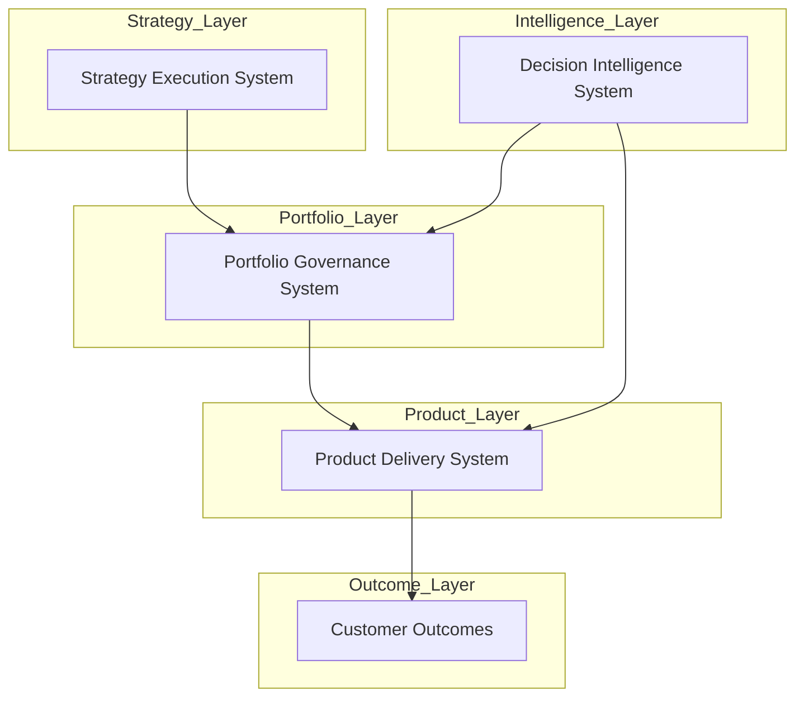

# Chuck Ferrando

Product leadership architect designing operating systems for strategy execution, portfolio governance, and product delivery.

---

## Product Leadership Systems Architecture

This architecture illustrates how enterprise strategy flows through portfolio governance and product execution systems to produce customer outcomes, supported by AI-assisted decision intelligence.

---

Explore the Systems

Each repository documents a core operating system used to run modern product organizations.

Strategy Execution System

How enterprise strategy is decomposed into themes, initiatives, and portfolio investments.
→ https://github.com/ChuckFerrando/strategy-execution-system

Portfolio Governance System

How initiatives are prioritized, funded, risk-scored, governed, and made visible across the portfolio.
→ https://github.com/ChuckFerrando/portfolio-governance-system

Product Delivery System

How product organizations structure teams, manage roadmaps, govern delivery, and measure outcomes.
→ https://github.com/ChuckFerrando/product-delivery-system

Decision Intelligence System

How AI can augment portfolio governance, delivery risk analysis, and executive decision preparation.
→ https://github.com/ChuckFerrando/decision-intelligence-system

Focus Areas

Product Operations Leadership

Portfolio Governance and Capital Allocation

Strategy Execution and Operating Model Design

Product & Engineering Organizational Systems

AI-Augmented Decision Support

